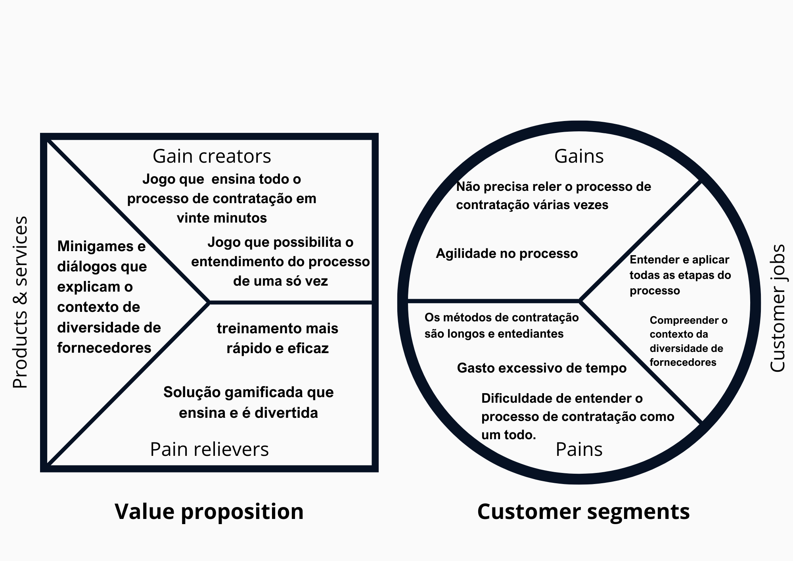

# Plano de Monetização Cometa

## Canvas de Proposta de Valor
Canvas Proposta de Valor da nossa solução:

## Primeiro Modelo:

### Venda do Produto Base

Iremos vender o jogo como produto inicial que conta com um treinamento sólido em contratação de fornecedores diversos, possibilitando que empresas tenham acesso ao nosso produto.

## Assinatura para Recursos adicionais personalizados

Ademais, ofereceremos um serviço de assinatura no qual a empresa contratante assina um valor mensal para receber atualizações constantes de novas funcionalidades e possibilidade de personalização.

### Teste gratuito

O cliente possui um período de teste gratuito para constatar se a solução atende suas necessidades.

### Assinatura

Após o teste gratuito, o cliente pode recorrer ao nosso sistema de assinatura, recebendo o seguintes benefícios:

**Suporte e manutenção**

Acesso ao conteúdo do treinamento, suporte individualizado,além de manutenções e atualizações durante todo o período do contrato.

**Personalização**

Adaptação da solução a necessidades específicas do cliente, com enfoque em temáticas específicas e adaptações requisitadas para melhor adequação.

## Preços

| Tamanho da empresa      | Investimento                |
| ----------------------- | --------------------------- |
| 1 - 10 colaboradores    | 1 Mês Grátis + R$57,90/mês  |
| 11 - 100 colaboradores  | 1 Mês Grátis + R$87,90/mês  |
| 101 - 499 colaboradores | 1 Mês Grátis + R$147,90/mês |
| + 500 colaboradores     | 1 Mês Grátis + R$327,90/mês |
